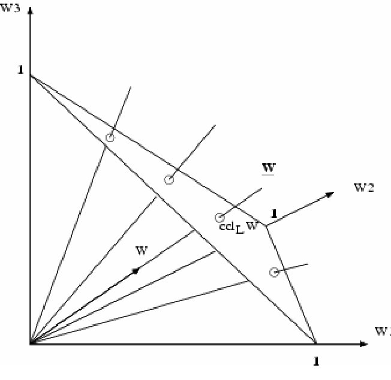

```{r setup, include=FALSE}
options(htmltools.dir.version = FALSE)
```
layout: true
background-image: url(UA.png)
background-size: 10%
background-position: right 10px bottom 10px

---

# Outline
- Compositional data
     - definition
     - applications
- Description of the method
- Results
- Discussion
- An original application (time permitting)

---

# What is compositional data?
## And why can't we just do a standard two-sample multivariate t-test?

.pull-left[

]

.pull-right[

- Compositional data is any data vector whose sum is constrained to be equal to one and whose members are non-negative.

- The constraint generates a strong correlation between data points in the multivariate setting and confounds traditional statistical methods (Aitchison, 2003)

- This paper in particular focuses on the scaling problem, which arises from the fact that a $p$-dimensional compositional vector lies on a $p-1$ dimensional hyperplane.
]
---

# What is compositional data?
## And why can't we just do a standard two-sample multivariate t-test?

.pull-left[

]

.pull-right[
- For any given vector $V$ of raw counts that generates a composition with a given coordinate on the hyperplane, there are an infinite number of other vectors $cV$ $\{c:c \in \mathbb{R}\}$, that generate that same coordinate.

- As a result, a multivariate test for differences in means can find significant differences between vectors that generate identical compositions (i.e. they are compositionally equivalent)

]

---
 
# What sorts of processes generate compositions?
### Mixing processes
- Gas mixtures
- Chemical reactions

### Count data, where the counts are only useful as estimates of fraction of total abundance
- Gene expression (always relative)
     - RNAseq
     - Arrays
- Microbiomes
     
### BONUS! compositions of compositions!!!
- Document topic modelling and classification
- Mutational process signatures in cancer genomes (my jam)

---

# A testable hypothesis of compositional equivalence

Suppose we have data matrices

$$X^{(k)} = (X^{(k)}_1, \dots, X^{(k)}_{n_k})$$
for groups $(k=1,2)$ such that
$$\{(x_1, \dots, x_p) : x_j \gt 0 \;\; (j = 1, \dots, p), \quad \sum_{j=1}^p x_j = 1\}$$
i.e, a matrix of compositions. Assume these compositions arise from some latent vector variable representing true abundances, such that
$$X_{ij}^{(k)} = W_{ij}^{(k)} \Big/ \sum_{l=1}^p W_{il}^{(k)} \quad (i = 1, \dots, n_k;\; j=1, \dots, p;\; k= 1,2)$$
is the component-wise relationship between $X^{(k)}$ and the variable of interest $W^{(k)}$.

The goal is to determine, using the measured quantities $X^{(k)}$, whether the $W^{(k)}$ are samples from distributions with different means. In other words, is there a difference between the distributions of groups 1 and 2. 

---

# A testable hypothesis of compositional equivalence
### A traditional multivariate t-test approach fails
Let $Z_{ij}^{(k)} = log(W_{ij}^{(k)})$ and suppose the $Z_i^{(k)}$ are independent samples, each from a distribution with mean vector $\mu_k = E(Z_1^{(k)}) \; (k=1,2)$ and common covariance matrix $\Omega$. We would like to test the hypotheses
$$H_0: \; \mu_1 = \mu_2 \quad \textrm{versus} \quad H_1: \; \mu_1 \ne \mu_2.$$ 

The scaling problem means we can not test this hypothesis through the observed $X^{(k)}$. Instead we might test for *compositional equivalence*, where two log-transformed vectors are *compositionally equivalent* if they differ only by a constant, leading to the hypotheses

$$H_0: \; \mu_1 = \mu_2 + c1_p\; \textrm{for some} \;c \in \mathbb{R}  \quad \textrm{versus} \quad H_1: \; \mu_1 \ne \mu_2 + c1_p\; \textrm{for any}\; c \in \mathbb{R}.$$
Unfortunately, rejecting $H_0$ here does not imply rejecting $E(X_1^{(1)}) = E(X_1^{(2)})$ because of the scaling factor, and thus does not lead to biological interpretations in terms of the underlying distributions.

---
# A testable hypothesis of compositional equivalence

### The centered log-ratio transform and an equivalent hypothesis

Aitchison(1982) proposed the log-ratio transform to deal with the non-independence of compositional variables.
This paper uses an additional centering transform to generate a set of hypotheses that are identical to

$$H_0: \; \mu_1 = \mu_2 \quad \textrm{versus} \quad H_1: \; \mu_1 \ne \mu_2.$$

Define $Y^{(k)} = (Y_1^{(k)}, \dots, Y_{n_k}^{(k)})$ as

$$Y_{ij}^{(k)} = \textrm{log} \{X_{ij}^{(k)} \big/ g(X_i^{(k)})\} \quad (i = 1, \dots, n_k;\;j = 1, \dots, p;\; k = 1,2),$$

where $g(x) = (\prod_{i=1}^p x_i)^{1/p}$ is the geometric mean. This is just the log version of mean centering a vector. This transform is scale invariant (see it?).
We can express this in matrix form as

$$Y_i^{(k)} = G\;\textrm{log}\,X_i^{(k)},$$

where $G = I_p - p^{-1}1_p1_p^T.$ 

---
# A testable hypothesis of compositional equivalence

### The centered log-ratio transform and an equivalent hypothesis

Let $\nu_k = E(Y_i^{(k)})$, and recognize that the scale-invariance of $Y^{(k)}$ means that we can replace $X^{(k)}$ with $W^{(k)}$ to get

$$Y_i^{(k)} = G\,Z_i^{(k)}.$$

This generates the equivalence

$$\nu_k = G\,\mu_k,$$
which implies that

$$\nu_1 - \nu_2 = 0 \iff G\,(\mu_1 - \mu_2) = 0.$$

The rank of $G$ is $p - 1$, and thus $Null(G) \equiv \{x \in \mathcal{R}^P\;:\;Gx = 0\} = \{c1_p\;:\;c \in \mathcal{R}\}.$<br \>
As a result we can write

$$\nu_1 - \nu_2 = 0 \iff \mu_1 - \mu_2 = c1_p \quad \textrm{for some} \; c \in \mathcal{R}$$

Now we have a test that is a scale-invariant equivalent to $\mu_1 = \mu_2 + c1_p \quad \textrm{for some} \; c \in \mathcal{R}.$

---

# A two-sample test for compositional equivalence

The authors suggest as a natural test statistic for 
$$H_0: \; \nu_1 = \nu_2 \quad \textrm{versus} \quad H_1: \; \nu_1 \ne \nu_2,$$ 
the difference in the sample means $\bar{Y}^{(1)}_j - \bar{Y}^{(1)}_j.$
They go on to say that in the sparse setting, which they assert is the case in microbiomes, it is well known that tests based on maximum-type statistics are more powerful than other statistics (citing themselves). They devise the test statistic

$$M_n = \frac{n_1n_2}{n_1 + n_2}\; \max_{1 \le j \le p} \frac{(\bar{Y}^{(1)}_j - \bar{Y}^{(1)}_j)^2}{\hat{\gamma}_{jj}},$$
where $\hat{\gamma}_{jj}$ is the standard pooled sample variance, and $M_n$ is the standard multivariate Hotelling $T$ statistic for the dimension with the largest variance adjusted mean difference.

They then show that $M_n$ asymptotically converges to a type-1 Gumbel (extreme value) distribution, and derive the level alpha test

$$\Phi_\alpha = I(M_n \ge q_\alpha + 2\;\textrm{log}\,p - \textrm{log log}\,p).$$

---
# Discussion break

### What do we think of the extreme value argument in practice?
### Does it match with our experience of microbiome or RNAseq studies?

```{r this_plot,echo=F,fig.height=5}
library(ggplot2)
load('week8stat.RDA')
ggplot(final8stat,aes(Family,stat)) + geom_col() + 
  labs(title="High fat vs low fat diet at week 8",subtitle="4 mice per group") +
  theme_bw() + theme(axis.text.x=element_text(angle=90)) + ylab('Statistic')
```